# Products Domain

The **Products** domain is responsible for managing all product-related information within WandaSync. This includes handling detailed product data, categorization, inventory tracking, and relationships with dealers and brands.

## Responsibilities

The main responsibilities of the Products domain are:

- **Product Information Management**: Handle detailed information about products, including specifications, pricing, and availability.
- **Categorization and Organization**: Classify products into categories, departments, and types for easy navigation and searchability.
- **Inventory Tracking**: Monitor stock levels and availability across different dealers.
- **Dealer Coordination**: Manage relationships with dealers who supply the products, including pricing and stock information.
- **Brand Management**: Maintain information about brands and their representatives.

These responsibilities are achieved through a set of entities that represent products, categories, dealers, and brands.

## Entities

The main entities in the Products domain are:

1. **ParentProduct**
2. **Product**
3. **Category**
4. **Department**
5. **ProductType**
6. **Dealer**
7. **ProductDealer**
8. **Brand**

Each entity is designed to store and manage the necessary information to fulfill the domain's responsibilities.

---

### Entity: ParentProduct

The `ParentProduct` entity represents the general information of a product without specific variations like size or color. It serves as a template for individual products.

#### Attributes

- **Reference**: Unique identifier for the parent product.
- **Brand**: Associated brand of the product.
- **Model**: Model name or number.
- **Material**: Materials used in the product.
- **Season**: Seasonality information (e.g., Spring/Summer 2024).
- **Category**: Reference to the product's category.
- **Department**: Reference to the department (e.g., Men's, Women's).
- **ProductType**: Reference to the type of product (e.g., Shoes, Accessories).
- **ParentStatus**: Indicates the lifecycle stage of the parent product (Active, Inactive, Discontinued, On Sale).

---

### Entity: Product

The `Product` entity inherits from `ParentProduct` and includes specific variations like size and color.

#### Attributes

- **EAN**: International Article Number for the specific product variation.
- **Size**: Size of the product (e.g., S, M, L, 42).
- **Color**: Color of the product.
- **Stock**: Derived attribute representing the total stock across all dealers.
- **DealerPrice**: Derived attribute indicating the dealer offering the lowest price.
- **Dealer**: Reference to the dealer offering the product at the lowest price.
- **RetailPrice**: Calculated retail price based on business rules.
- **Status**: Indicates the lifecycle stage of the product (Active, Inactive, Discontinued, On Sale, Out of Stock).

---

### Entity: Brand

The `Brand` entity represents the brands associated with products.

#### Attributes

- **Name**: Name of the brand.
- **Contact**: Contact information for the brand.
- **Status**: Indicates the lifecycle stage of the brand (Active, Inactive, Discontinued).

---

### Entity: Category

The `Category` entity organizes products into hierarchical groups.

#### Attributes

- **Name**: Name of the category.
- **Description**: Description of the category.
- **ParentCategory**: Reference to a parent category for hierarchical structuring.
- **Status**: Indicates the lifecycle stage of the category (Active, Inactive).

---

### Entity: Department

The `Department` entity classifies products based on target audience.

#### Attributes

- **Name**: Name of the department (e.g., Men's, Women's, Unisex).
- **Description**: Description of the department.
- **Status**: Indicates the lifecycle stage of the department (Active, Inactive).

---

### Entity: ProductType

The `ProductType` entity specifies the type of product.

#### Attributes

- **Name**: Name of the product type (e.g., Shoes, Bags).
- **Description**: Description of the product type.
- **Status**: Indicates the lifecycle stage of the product type (Active, Inactive).

---

### Entity: Dealer

The `Dealer` entity represents the suppliers or vendors providing the products.

#### Attributes

- **Name**: Name of the dealer.
- **Description**: Description of the dealer.
- **Contact**: Contact information for the dealer.
- **Status**: Indicates the lifecycle stage of the dealer (Active, Inactive).

---

### Entity: ProductDealer

The `ProductDealer` is an association entity between `Product` and `Dealer`, managing stock and pricing information for each dealer.

#### Attributes

- **Product**: Reference to the `Product` entity.
- **Dealer**: Reference to the `Dealer` entity.
- **UnitStock**: Number of units available from the dealer.
- **UnitPrice**: Price per unit offered by the dealer.
- **Status**: Indicates the lifecycle stage of the product-dealer relationship (Available, Unavailable, Out of Stock, Incorrect Price, Incorrect Stock, etc.).

## Class Diagram

The following class diagram illustrates the structure of the Products domain, showcasing the entities and their relationships.

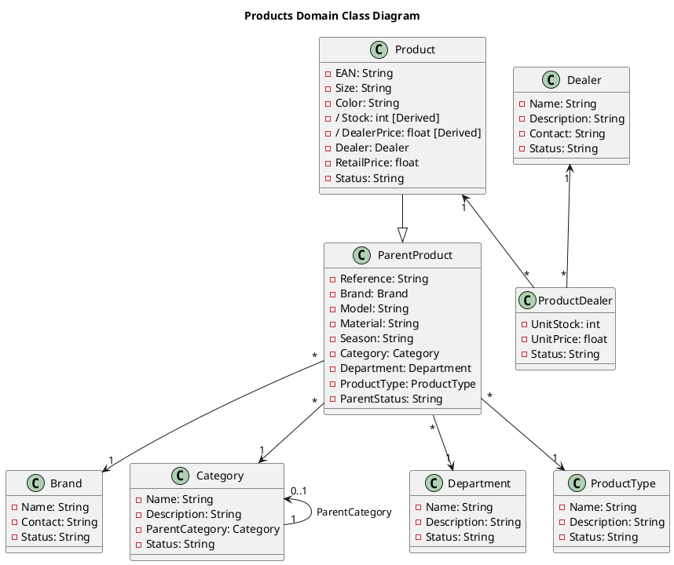

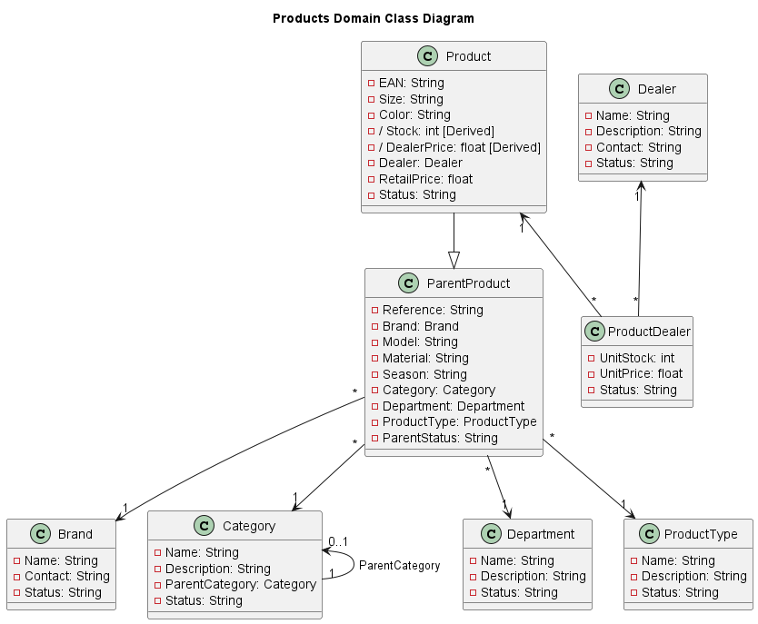

**Explanation:**

- **ParentProduct**: Acts as a template for products without specific variations. It has associations with `Brand`, `Category`, `Department`, and `ProductType`, indicating that each parent product is linked to these entities.
  
- **Product**: Inherits from `ParentProduct` and includes specific attributes like `EAN`, `Size`, and `Color`. It has derived attributes `Stock` and `DealerPrice`, calculated based on associated `ProductDealer` data. The `Dealer` attribute references the dealer offering the lowest price.

- **Brand**: Represents product brands with contact information and status.

- **Category**: Organizes products into a hierarchy using the `ParentCategory` self-reference, allowing for nested categories.

- **Department** and **ProductType**: Classify products further, aiding in organization and searchability.

- **Dealer**: Represents suppliers, holding information necessary for coordination and management.

- **ProductDealer**: An association class between `Product` and `Dealer` that manages stock and pricing per dealer. It captures the many-to-many relationship where a product can be supplied by multiple dealers, and a dealer can supply multiple products.

- **Relationships**:

  - **Inheritance**: `Product` inherits from `ParentProduct`, signifying that all attributes of `ParentProduct` are available in `Product`.
  
  - **Associations**: Solid lines indicate associations between entities. Multiplicities (e.g., `"*"` for many, `"1"` for one) show how many instances of one entity relate to another.

- **Multiplicity Notations**:

  - `"1"`: Exactly one instance.
  - `"*"`: Zero or more instances.
  - `"0..1"`: Zero or one instance.

## Lifecycle of Entities

Each entity in the Products domain follows a specific lifecycle, representing the various states an entity can be in and how it transitions between these states. Below are the lifecycle diagrams for each entity, along with brief descriptions.

### Entity: ParentProduct

The lifecycle of `ParentProduct` captures the stages from creation to discontinuation.

#### States and Descriptions:

- **Draft**: The product is being prepared and is not yet visible in the catalog.
- **Active**: The product is available and visible to customers.
- **On Sale**: The product is active and currently under a promotion.
- **Discontinued**: The product is no longer produced or supported.
- **Inactive**: The product is archived and not visible in the catalog.

#### Lifecycle Diagram:

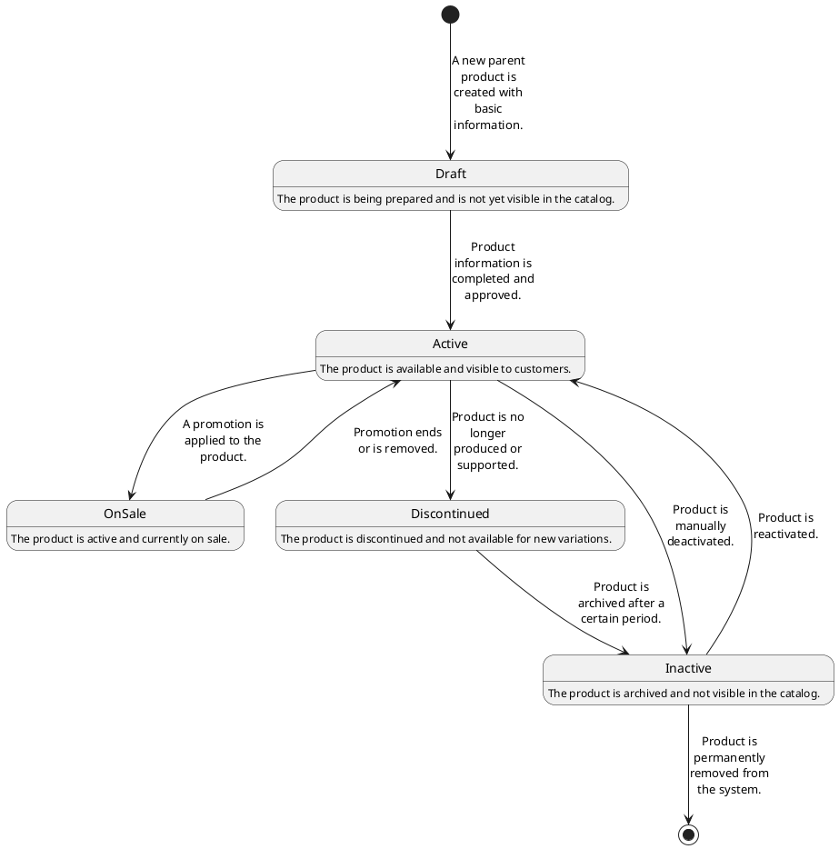

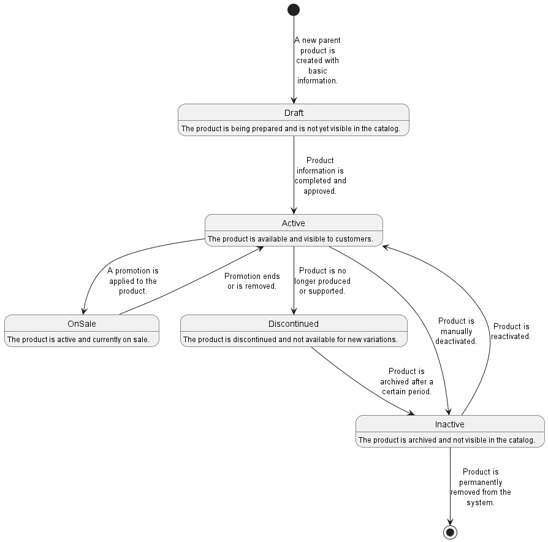

---

### Entity: Product

The lifecycle of `Product` reflects the availability and status of individual product variations.

#### States and Descriptions:

- **Draft**: The product variation is being prepared and is not yet available for purchase.
- **Active**: The product variation is available for purchase.
- **On Sale**: The product variation is active and under promotion.
- **Out of Stock**: The product variation is temporarily unavailable due to no stock.
- **Discontinued**: The product variation is no longer available.
- **Inactive**: The product variation is archived and not visible to customers.

#### Lifecycle Diagram:

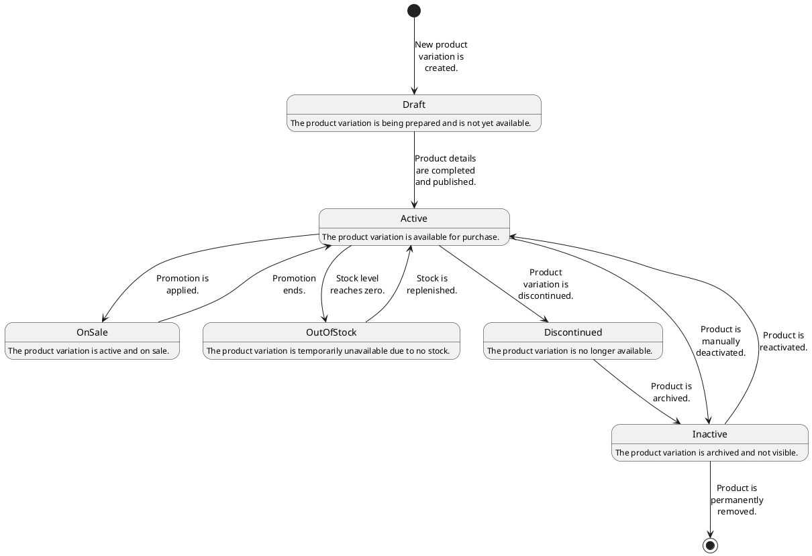

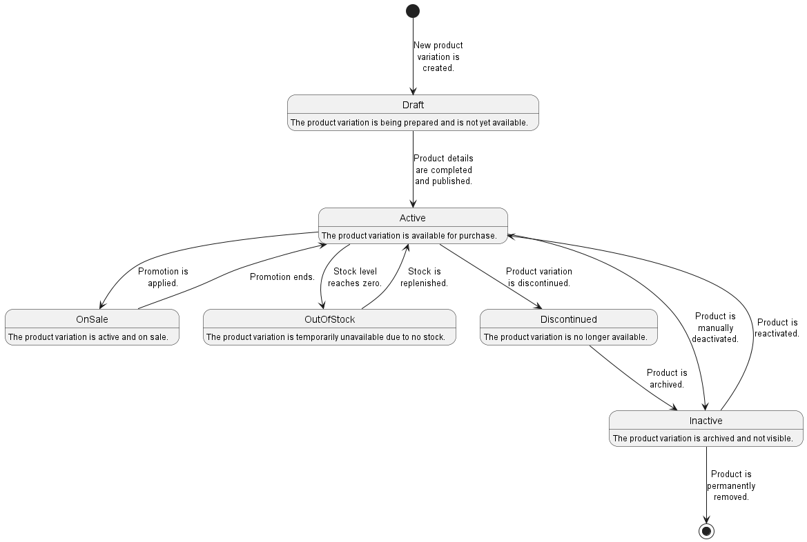

---

### Entity: Brand

The lifecycle of `Brand` manages the status of brands associated with products.

#### States and Descriptions:

- **Active**: The brand is actively associated with products.
- **Inactive**: The brand is temporarily not in use but remains in the system.
- **Discontinued**: The brand is permanently discontinued and not used in new products.

#### Lifecycle Diagram:

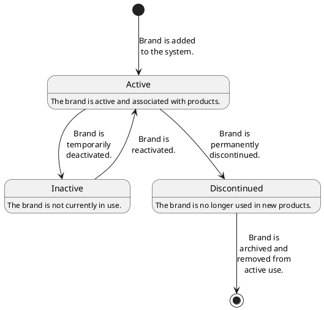

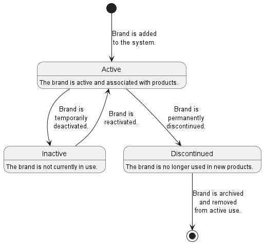

---

### Entity: Category

The lifecycle of `Category` handles the availability of categories for product classification.

#### States and Descriptions:

- **Active**: Category is available for product classification.
- **Inactive**: Category is no longer used but remains in the system.

#### Lifecycle Diagram:

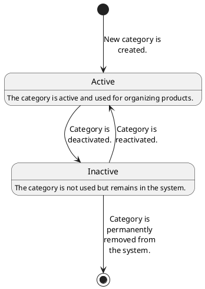

---

### Entity: Department

The lifecycle of `Department` manages the use of departments in product classification.

#### States and Descriptions:

- **Active**: Department is used for classifying products.
- **Inactive**: Department is no longer in use.

#### Lifecycle Diagram:

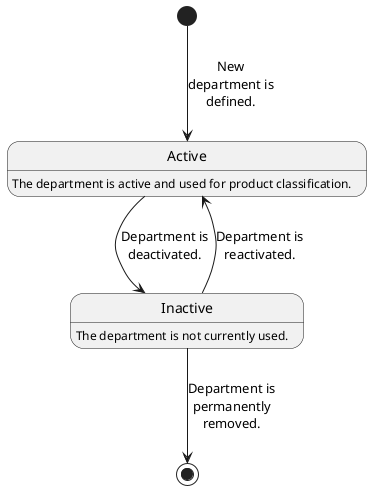

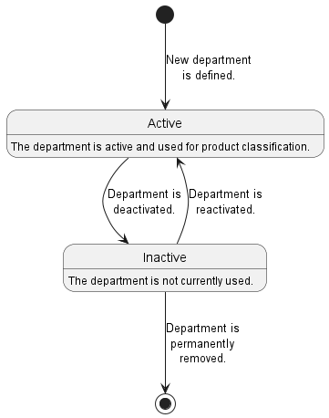

---

### Entity: ProductType

The lifecycle of `ProductType` oversees the availability of product types for classification.

#### States and Descriptions:

- **Active**: Product type is available for classifying products.
- **Inactive**: Product type is no longer used.

#### Lifecycle Diagram:

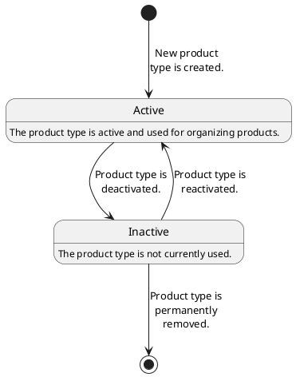

---

### Entity: Dealer

The lifecycle of `Dealer` reflects the status of suppliers in the system.

#### States and Descriptions:

- **Active**: Dealer is actively supplying products.
- **Inactive**: Dealer is temporarily not supplying products.
- **Terminated**: Relationship with the dealer is ended.

#### Lifecycle Diagram:

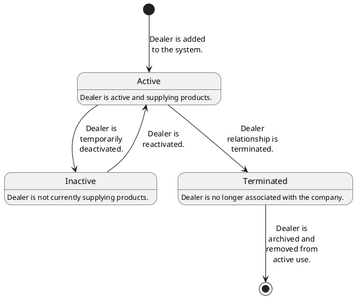

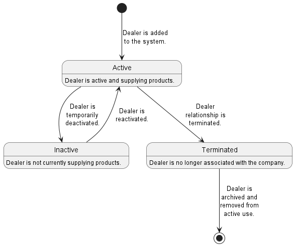

---

### Entity: ProductDealer

The lifecycle of `ProductDealer` manages the association between products and dealers.

#### States and Descriptions:

- **Available**: Product is available from the dealer.
- **Unavailable**: Product is temporarily unavailable.
- **Out of Stock**: Dealer has no stock of the product.
- **Incorrect Price**: Price information is invalid or outdated.
- **Incorrect Stock**: Stock information is invalid or outdated.
- **Inactive**: Association is deactivated.

#### Lifecycle Diagram:

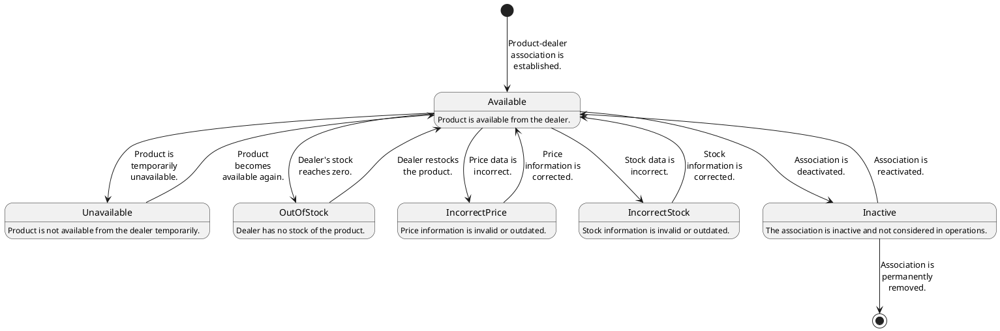

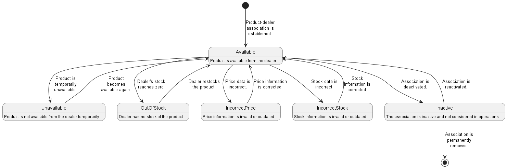